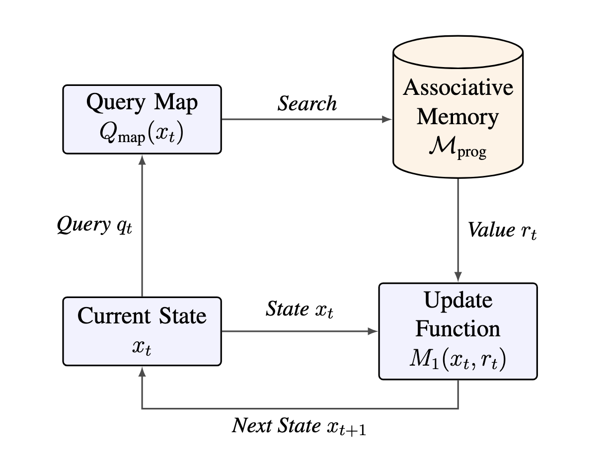

# Are Transformers Just "Stochastic Parrots"?
Date: February 10, 2026
By Tomaso Poggio, John Gabrieli Buchet

Associative Memories are Turing Complete

## Why Modern AI is Actually a Programmable Computer

A common criticism of Large Language Models (LLMs) is that they are merely "stochastic parrots"—statistical mimics that stitch together likely patterns without genuine reasoning. This view suggests they are powerful impostors, lacking the logical core of a "real" computer.
 
But there is a different perspective. If we look mathematically at the architecture powering these models—the **Transformer**—we find something surprising. It isn't just a pattern matcher; it is a fully capable, programmable computer.
 
In this summary, we strip away the complexity to introduce the **Associative Turing Machine (ATM)**. This model proves that the mechanisms inside current AI (Attention and Feed-Forward Networks) are theoretically equivalent to the logic gates and RAM of a classical computer.

## 1. The Missing Link: Associative Memory

Classical computers use **Random Access Memory (RAM)**. To find data, you need its exact numerical address (e.g., `0x3F2A`).
 
Neural networks don't work like that. They use **Associative Memory** (or "Content-Addressable Memory"). To find data, you don't ask *where* it is; you ask for *what* it is similar to. You broadcast a query ("President of the US"), and the memory returns the closest match ("Biden" or "Trump"), regardless of where it is stored. For decades, we treated this as a fuzzy biological quirk. But it turns out, you can build a precise Turing Machine out of it.

## 2. How an Associative Turing Machine Works

An Associative Turing Machine (ATM) replaces the rigid tape of a classical computer with a continuous, searchable memory. Its "CPU cycle" consists of two simple steps that repeat forever:

1. **Read (The Memory)**: The system looks at its current state and generates a "Query." It broadcasts this query to its memory banks. The memory returns a weighted mix of the most relevant information.

Figure 1: Classical RAM requires specific addresses. Associative Memory retrieves data based on content similarity, a more robust method for high-dimensional spaces.

2. **Update (The Processor)**: The system takes that retrieved information and processes it through a function to decide its new state.
 
This "Read → Update" loop allows the machine to jump around its memory based on context, rather than sequential addresses.

## 3. The "Aha!" Moment: Transformers are ATMs

Here is where the theory meets reality. If you look at the architecture of a standard Transformer block (the building block of LLMs), it maps one-to-one onto this computational cycle.
 
The Transformer is not just simulating this process; it *is* this process.

- **The Memory (Keys & Values)**: The matrices in the Attention layer ($K$ and $V$) act as the stored program. The "Keys" are the conditions (e.g., "If $x$ is 5"), and the "Values" are the instructions (e.g., "Then $y$ is 10").

- **The Read (Self-Attention)**: When the model performs "Self-Attention," it is executing a fuzzy `GOTO` command. It searches its entire context to find the relevant data needed for the current step.

- **The Processor (Feed-Forward Network)**: The dense layer at the end of the block (the MLP) acts as the CPU. It takes the retrieved data and computes the result.

## 4. Programming via Gradient Descent

If Transformers are computers, who writes the code?

*Figure 2: The ATM Cycle: The state generates a query, the memory returns a value (based on similarity), and the update function combines the read value with the old state to compute the next state.*
 
In a classical computer, a human engineer writes C++ or Python. In an ATM, the "software" is the set of Key-Value pairs stored in the weights.
 
When we train an LLM on massive datasets, **Gradient Descent is the programmer.** It slowly adjusts the weights, effectively writing a complex program into the memory that tells the machine how to process input. We aren't just teaching it statistics; we are compiling an algorithm into its neural substrate.

## 5. Why This Matters

This framework bridges the gap between classical Computer Science and Deep Learning. It gives us a mathematical proof (the **Turing-Equivalence Theorem**) that attention-based architectures can solve any problem a standard computer can solve, given enough time and memory.
 
LLMs are not just parrots mimicking speech. They are silicon computers that have learned their own operating system.