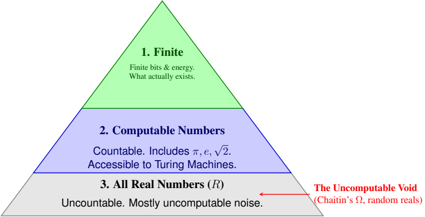

# Most Real Numbers Do Not Exist (And Why That Matters for Intelligence)
Date: January 20, 2026
By Tomaso Poggio

The most useful mathematical objects are the ones that aren’t real at all.

We think of numbers as the foundation of science. We measure positions, voltages, masses, probabilities, and temperatures using quantities that—at least in theory—take values in the contin-uum of real numbers. This continuous line underpins classical mathematics and physics.

But when we examine real numbers through the lenses of logic, computation, and physics, a striking conclusion emerges:

Real numbers—uncountable, infinitely precise objects—do not exist in nature. They are mathematical idealizations.

This insight is central to understanding intelligence and computation.

## 1. Logic: The Continuum Is Not a Logical Necessity

The continuum hypothesis, a fundamental question about the size of the real line, was shown by Godel and Cohen to be ¨ undecidable from the standard axioms of mathematics. This means that the existence of a continuous infinity of real numbers is not a logical consequence of our usual foundations. It is a choice.

## 2. Computation: Almost All Real Numbers Are Uncomputable

A real number requires infinitely many bits to store exactly. But finite machines—including brains, computers, and physical systems—cannot store or generate infinite precision.

In fact:

- almost all real numbers have no finite description,

- they cannot be approximated algorithmically,

- and no Turing machine can compute them.

They lie beyond the reach of any physical or computational process.

Figure 1: The Hierarchy of ”Reality.” While mathematics assumes the existence of the entire gray pyramid (the continuum), computation is restricted to the blue triangle, and physical reality— limited by finite energy and entropy—is restricted to the green tip. Most real numbers are mathe-matical fictions that can never be measured or stored.

## 3. Physics: We Never Measure Anything with Infinite Precision

The universe has finite energy, finite time, and finite resolution. No physical measuring device can produce infinitely many bits or distinguish infinitely close values.

What physicists call “continuous quantities” are idealized models, not physical objects. Nature gives us finite, discrete data.

Why information is finite despite the infinity of rational numbers. A common confusion arises here: if there are infinitely many rational numbers, how can information in the physical world be finite? The resolution is simple. Although rational numbers form an infinite set, a finite physical system cannot represent arbitrarily large integers or arbitrarily fine ratios. Representing a rational p/q requires storing the integers p and q, but a system with finite energy, finite volume, and finite entropy can only store a finite number of bits. Thus only finitely many rationals are physically representable, even in principle. Moreover, every real measurement has finite resolution, so the set of distinguishable values in any experiment is always a finite discrete lattice. In this precise sense, information in physics is finite even though mathematics allows infinite numerical sets.

## Maps, Not Territory

Real numbers are like maps: extraordinarily useful but ultimately simplified representations of a more complex, finite world.

They let us reason elegantly, but they are not themselves part of physical reality.

## Why This Matters for Intelligence

If the physical world does not contain real numbers, then:

- information is finite,

- computation is finite,

- and learnable functions must be finite and structured.

This ties directly into the two pillars of this blog series:

## Sparse Compositionality

Finite computation produces hierarchical, bounded-fanin processes. There is no capacity for dense, unstructured, infinite-precision functions.

## Genericity

Finite physical systems are noisy and stable. Thus real-world functions have detectable low-degree components, making learning feasible.

The nonexistence of real numbers is not a limitation—it is what makes intelligence and learning possible.

## A Glimpse Ahead

Some physical systems, especially chaotic dynamical systems, may not be efficiently computable even in principle. We will explore this subtle topic in a future post on chaos, prediction, and simulation.

For now, the key point is this:

Intelligence is possible because the universe is finite. Continuous mathematics is the useful fiction that helps us understand it.

## Technical Note: Algebraic and Transcendental Real Numbers

This appendix provides a brief mathematical background on two central classes of real numbers: algebraic and transcendental numbers. Understanding their structure clarifies why almost all real numbers are mathematically legitimate but physically meaningless.

## Algebraic Real Numbers

A real number $\alpha$ is called algebraic if it is a root of a polynomial with integer coefficients:

\( a_{0}+a_{1} \alpha+\cdots+a_{d} \alpha^{d}=0, \quad a_{i} \in Z \).

Examples include:

- all rational numbers,

- $\sqrt{2}$, $\sqrt[3]{5}$, $i$ (in the complex case),

- roots of any finite-degree polynomial equation.

Key facts:

1. The set of algebraic numbers is countable.

2. Every algebraic number has a finite description: it is fully determined by a finite polynomial and its degree.

3. All algebraic numbers are computable: a Turing machine can approximate them to arbitrary precision since root-finding is a constructive process.

Thus algebraic numbers form the “computational core” of the real line: they are the numbers that can sensibly arise in algorithms, physical models, and finite systems.

## Transcendental Numbers

A real number is transcendental if it is not algebraic—that is, it is not the root of any integer-coefficient polynomial. Famous examples include:

\( \pi, \quad e, \quad \) Liouville numbers.

The structure of the transcendental numbers is radically different:

1. The set of transcendental numbers has the same cardinality as the continuum. In fact: (allreals) = (algebraic) ∪ (transcendental), and since algebraic numbers are countable, almost all real numbers (measure 1) are tran-scendental.

2. Almost all transcendental numbers are uncomputable. They have no finite description, no generating algorithm, and no Turing machine that can list their digits.

3. A typical transcendental number cannot even be approximated in principle: its first million digits might encode an incompressible random string that no physical system could store.

This is the source of a paradoxical conclusion:

Almost every real number is a perfectly valid mathematical object that cannot, even in principle, appear in physical reality.

## Consequences for Physics and Intelligence

Because algebraic numbers are computable and finitely specifiable, they (and a small subset of computable transcendental numbers such as π and e) are the only real numbers that can arise in:

- finite physical measurements,

	• digital computation,

- neural or biological systems,

- any finite-energy physical process.

Transcendental numbers of measure 1 on the real line require infinite precision, infinite entropy, and infinite memory—none of which exist in physics.

Thus:

From the standpoint of computation and physics, the “real line” is a useful fiction. The physically meaningful numbers form a tiny, structured, computable subset.

This supports the main thesis of the blog:

- information in the universe is finite,

- learnable functions must be structured and computable,

- continuous mathematics is an idealization, not a physical ontology.

These facts motivate the two pillars discussed elsewhere in the series: sparse compositionality (the structure required by finite computation) and genericity (the low-degree signals imposed by finite, noisy systems).
