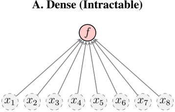

# The First Principle: Solving Problems with LEGO Bricks
Date: January 25, 2026
By Tomaso Poggio, Dmitry Mitropolsky

Why can we understand a complex world? Because much of it is not a random mess—it is a hierarchy of reusable parts.

In our last post, we argued that modern AI resembles the period between Volta and Maxwell: we can build remarkable systems, but we do not yet have a fundamental scientific theory. We suggested that such a theory must rest on two pillars:

- Sparse Compositionality — a structural principle about how the world is organized;

- Genericity — a principle about why learning algorithms succeed in high-dimensional spaces.

Today we turn to the first principle. Before using metaphors or examples, we begin with the central theoretical fact.

## Sparse Compositionality Follows from Efficient Computability

A foundational observation from the theory developed in our book is that:

Sparse compositionality isn’t just a lucky feature of our data. It is a mathematical necessity of efficient computation.

Any function that a physical or digital machine can compute in polynomial time must be ex-pressed as a sequence of local operations. Locality forces bounded fan-in. Sequentiality forces composition along a directed acyclic graph. And computational efficiency forces this DAG to be sparse.

Thus:

Every function that is efficiently computable—and therefore every function that can be learned or simulated by a finite machine—must be sparse and composi-tional.

This is why deep networks can approximate the kinds of functions that arise in nature. Their architecture mirrors the hierarchical, low fan-in DAG required by efficient computation.

A subtle but important caveat. The claim that the world is sparsely compositional because it is efficiently computable raises a natural question: is the physical world in fact efficiently com-putable? Surprisingly, this is not obvious. Certain physical systems—especially chaotic dynamical systems, turbulent flows, and high-energy many-body interactions—appear to require exponential resources to simulate with arbitrary precision. In such cases, efficient computability may fail, or hold only in an approximate, coarse-grained sense. This does not undermine sparse composition-ality as a principle; rather, it shows that the relationship between computation and physical law is subtle. We will return to this topic in a later post, where we examine whether nature is fundamen-tally computable, and what it means for intelligence if some physical processes are not.

## The LEGO Principle

With the computational foundation established, we now turn to intuition. Imagine a giant bucket of LEGO bricks. With a few dozen types of simple pieces, you can assemble an unbounded variety of structures. The magic isn’t in the bricks themselves; it’s in the rules of combination.

Three ingredients matter:

1. Simplicity: Basic building blocks are simple and reusable.

2. Hierarchy: Small structures combine to form larger ones.

3. Sparsity: Only a tiny subset of bricks is needed for any given construction.

This captures the essence of Sparse Compositionality. The central argument of this series is that the functions governing the real world—vision, language, physics, motor control—are struc-tured exactly this way.

## Seeing the Structure

Let us examine domains where this structure is most evident.

- Vision. A natural image is not a random array of pixels. It contains objects; objects contain parts; parts contain edges, corners, and textures. Deep networks naturally learn these layers of abstraction.

- Language. A sentence is a hierarchical composition: phonemes $\to$ morphemes $\to$ words $\to$ phrases $\to$ clauses. Even a novel sentence such as “The purple giraffe played chess on the moon” is instantly interpretable because its compositional elements follow familiar rules.

- Physics. Physical laws are overwhelmingly local. The behavior of a particle depends pri-marily on its immediate neighbors, not on a particle in another galaxy. Macroscopic behavior emerges from composing many local interactions.

In all these systems, complexity arises from structured reuse, not randomness.

## The Technical Hook: Computational Graphs

Mathematically, sparse compositionality is captured by the structure of a computational graph. A general dense function has a graph where each output depends on nearly all inputs; such functions are unlearnable in practice.

Compositionally sparse functions, by contrast, have:

- Bounded fan-in: each node depends on only a few inputs;

- Depth: a layered hierarchical structure.

Deep learning works because deep networks implement exactly these kinds of graphs. Their success reflects the structure of the world.

Curse of Dimensionality: The output depends on all inputs simultaneously. Fan-in is d. Number of samples required is exponential in d.

Blessing of Compositionality: The function is built from local opera-tions. Fan-in is bounded (here, 2). Learnable with polynomial samples.

Figure 1: Visualizing the Difference. Left: A dense function where the output depends directly on all inputs (high fan-in). Right: A sparse, compositional function where the output is computed via a hierarchy of local operations (bounded fan-in).

## A Profound Implication

Here is the central takeaway:

The reason intelligence is possible is that much of the world is computable. And the reason the world is computable is that it is sparse and compositional.

If the world’s governing functions were dense and unstructured, no finite organism or machine could learn them—not even evolution. Sparse compositionality is therefore both a property of the environment and a requirement for learnability.

Next time, we turn to the second pillar: Genericity. If the world is a giant LEGO set, Genericity explains how a simple algorithm, groping in the dark, can actually figure out how to put the pieces together.

## Technical Note: Efficient Computability Implies Sparse Compositionality

For readers interested in the mathematical backbone behind this principle, we summarize the key structural fact:

Any function computable by a deterministic Turing machine in time T (n) can be represented by a computation DAG of depth O(T(n)) and constant (or bounded) fan-in.

This provides the formal link between efficient computability and sparse compositionality.

## Theorem (Informal)

Let f : {0 , 1} n $\to$ {0 , 1} m be a function computable by a deterministic Turing machine in time T(n). Then f can be implemented by a directed acyclic graph (a circuit) with:

- depth O(T(n)),

- fan-in $\leq$ 2 at every node,

- size polynomial in T (n).

In particular, all efficient computations admit a bounded-fan-in compositional structure.

## Proof Sketch

A Turing machine running for T(n) steps performs a sequence of local updates to a fixed-sized control register, a finite tape alphabet, and a head position. Each step depends on only a constant amount of information.

By unrolling the computation in time, one obtains a layered circuit:

\( \operatorname{state}_{t+1}=F\left(\operatorname{state}_{t}\right) \),

where F has constant fan-in and constant output dimension. Composing these layers T (n) times yields a computation DAG of depth T(n) and bounded fan-in.

This DAG is precisely a sparse compositional architecture: every node depends on only a few predecessors, and the global computation arises from composing many simple, local transfor-mations.

## Interpretation

The theorem shows that:

- Sparse compositionality is not an empirical coincidence.

- It is a necessary structural property of any function that can be computed efficiently.

- Therefore it must hold for any function that can be learned, simulated, or represented by a finite physical or biological system.

This is the theoretical core of the first pillar.
