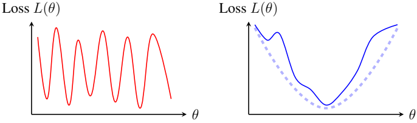

# The Second Pillar: Genericity
Date: February 2, 2026
By Tomaso Poggio, Pierfrancesco Beneventano

Why learning works at all—and why not all functions are learnable.

In our last post, we explored the first pillar of intelligence: Sparse Compositionality. It explains the structure of the functions we want to learn: they must be sparse, hierarchical, and built from simple reusable components. Sparse compositionality tells us what learnable functions look like.

But it does not tell us why learning succeeds.

This brings us to the second principle:

## Genericity.

Where compositionality is about structure, genericity is about geometry: the shape of the opti-mization landscape, the presence of gradients, and the existence of stable signals that guide learn-ing.

Genericity answers one of the deepest puzzles in modern AI:

Why does training enormous neural networks with simple gradient descent actu-ally work?

## Why Optimization Should Have Been Impossible

High-dimensional nonconvex optimization should, in principle, be hopeless. A naive theoretical picture suggests that training a neural network in a million-dimensional space should lead to:

- countless poor local minima,
- flat plateaus where gradients vanish,
- chaotic behavior,
- and no guarantee of convergence.

Yet in practice, none of this happens. Stochastic gradient descent:

- converges reliably,
- finds good solutions across architectures,
- reaches global minima in massively overparameterized models,
- is robust to noise and initialization.

The question is: Why?

## The Principle of Genericity

The principle of Genericity states that:

The functions that arise in the real world, and the learning problems we care about, lie in a special “generic” subset of all possible functions—those that leave stable, low-order footprints that optimization can detect.

In other words:

- They have strong low-degree components (especially linear terms).
- Their gradients do not vanish everywhere.
- Small perturbations do not destroy their structure.
- The loss landscape contains reliable signals rather than adversarial traps.

Generic functions are well-behaved. They are stable, smooth, and cooperative enough for learning to succeed.

Figure 1: Visualizing Genericity. (A) A pathological landscape (like a parity function) has no low-order structure; local gradients tell you nothing about the global minimum. (B) A generic landscape may be nonconvex and noisy, but it possesses a dominant low-degree “footprint” (the dashed basin) that guides gradient descent toward good solutions.

Without genericity, learning would be impossible, not just for neural networks but for biologi-cal brains and evolutionary processes.

## An Analogy: Finding North in the Fog

Imagine walking through a mountainous landscape covered in fog. If the terrain is perfectly flat in every direction (or wildly jagged), you will never find your way.

But if there is even a faint slope—a low-order signal—you can follow it. Step by step, you make progress without ever seeing the final destination.

Genericity says: real-world functions have these faint slopes. They leave low-degree traces that make optimization possible.

## Where Does Genericity Come From?

Why should the world be generic? Several forces push functions toward this benign subset:

1. Physics enforces smoothness and stability. Physical laws change continuously with con-tinuous inputs and suppress pathological behavior.

2. Evolution filters out fragile computations. Neural systems that rely on improbable coin-cidences or vanishing signals do not survive.

3. Noise destroys high-frequency irregularities. Real data is noisy; noise tends to wash away adversarial high-order components and highlight low-order structure.

4. Learning architectures impose inductive biases. Deep networks naturally emphasize low-degree structure (e.g., linear terms in early training).

The convergence of physics, biology, noise, and learning theory all point to the same conclu-sion:

The functions we care to learn are far from arbitrary. They are generic.

## Genericity as a Conjecture

Unlike sparse compositionality—which follows from efficient computability and is well-established— genericity is closer to a working conjecture:

- It is strongly supported by empirical evidence.
- It is consistent with results in optimization and overparameterization.
- It is motivated by physics, biology, and computational constraints.

But it is not yet a complete theorem. It is an organizing hypothesis for understanding why learning works.

## Why Genericity Completes the Picture

Together, sparse compositionality and genericity form a coherent view:

- Sparse compositionality makes the target function learnable in principle.
- Genericity ensures it is learnable in practice.

With these two principles, we gain a unified explanation for:

- why deep networks succeed,
- why evolution can discover complex behaviors,
- why generalization is possible,
- why optimization rarely gets stuck,
- and why intelligence—natural or artificial—can emerge in a complex universe.

## What Comes Next

In the next posts, we will explore the consequences of genericity:

- why linear terms matter so much for optimization,
- how genericity emerges from noise, evolution, and data,
- why model size helps optimization,
- and what happens when genericity fails.

We will also address a deep open question:

## Is the physical world itself generic and efficiently computable—or only approxi-mately so?

This will connect naturally to a future post on chaos, simulation, and computability. For now, we have the two pillars:

Sparse Compositionality and Genericity.

Together, they may form the beginnings of a theory of intelligence.

## Technical Appendix: Hermite Expansion and the Crucial Role of Low-Degree Components

## 1. Functions Have a Natural Spectral Expansion

A central idea underlying the principle of Genericity is that the functions we want to learn can be decomposed into orthogonal degrees. When the input distribution is Gaussian (or close to Gaussian after whitening), the natural basis is the system of multivariate Hermite polynomials $\{H_\alpha(x)\}$:

\[
H_{\alpha}(x)=\prod_{i=1}^{d} H_{\alpha_{i}}\left(x_{i}\right), \quad \alpha=\left(\alpha_{1}, \ldots, \alpha_{d}\right) \in N^{d}
\]

Every square-integrable function \( f: R^{d} \rightarrow R \) admits an expansion:

\( f(x)=\sum_{\alpha \in N^{d}} \hat{f}_{\alpha} H_{\alpha}(x), \quad \hat{f}_{\alpha}=E[f(X) H_{\alpha}(X)] \),

where $X \sim N(0, I_d)$. The Hermite degree of $H_\alpha$ is $|\alpha| = \sum_i \alpha_i$. Low-degree terms ($|\alpha| = 0, 1, 2$) capture smooth, slowly varying structure; high-degree terms contain oscillatory, fragile, or highly nonlinear components.

## 2. Low-Degree Terms Produce Learnable Gradients

Genericity asserts that real-world functions possess nontrivial low-degree components. The most important is the degree-1 (linear) part:

\( f_{\mathrm{lin}}(x)=\sum_{i=1}^{d} \hat{f}_{e_{i}} x_{i}, \quad e_{i}=(0, \ldots, 1, \ldots, 0) \).

This linear component creates a reliable global trend in the loss landscape. The gradient of f is:

\( \nabla f(x)=\sum_{\alpha} \hat{f}_{\alpha} \nabla H_{\alpha}(x) \).

A key identity for Hermite polynomials is:

\( E\left[\left\|\nabla f(X)\right\|^{2}\right]=\sum_{\alpha}\left|\alpha\right| \hat{f}_{\alpha}^{2} \).

Thus:

## The magnitude of the gradient is controlled by low-degree Hermite coefficients, especially the linear ones.

If all $\hat{f}_{e_i} = 0$ (no linear term), gradients are much weaker and learning slows dramatically. If all coefficients of degrees 1 through k vanish, no gradient-based method can recover that structure without exponentially many samples.

## 3. The Information Exponent

The information exponent, introduced in the book, formalizes this idea: it is the smallest Hermite degree $\ell$ for which the coefficient vector {

$\{\hat{f}_\alpha : |\alpha| = \ell\}$ does not vanish.

\( \ell(f)=\min \{|\alpha|: \hat{f}_{\alpha} \neq 0\} \).

Interpretation:

- $\ell$ = 1 (generic): strong linear signal; optimization is effective.
- $\ell$ = 2: quadratic structure exists but linear terms vanish.
- $\ell$ $\gg$ 1 (non-generic): function behaves like parity; gradients carry almost no globally useful information.

Generic functions have $\ell$ = 1. This ensures that the optimization landscape contains a global “tilt”—a weak but reliable slope guiding gradient descent.

## 4. Why Parity-Like Functions Are Pathological

Consider the parity function on {+1 , −1 } d or its Gaussian analog:

\( f(x)=\prod_{i=1}^{d} x_{i} \).

Its Hermite expansion consists solely of the monomial of degree d. Thus:

- all \( \hat{f}_{\alpha}=0 \) for \( |\alpha|<d \),

- the information exponent is $\ell$ = d,
- gradients vanish in expectation,
- optimization receives no informative signal.

This illustrates the essence of non-genericity: the function is structurally “orthogonal” to all low-degree components. Learning parity requires sample complexity exponential in d.

## 5. Noise, Evolution, and Data Generically Reduce $\ell$

In real-world systems, high-degree Hermite components are extremely fragile:

- Noise attenuates high-degree terms exponentially fast.
- Evolution eliminates computations that rely on vanishing signal.
- Physical systems enforce smoothness, suppressing high frequencies.
- Neural network training exhibits a spectral bias: low-degree coefficients are learned first.

All these mechanisms push real-world functions into the $\ell$ = 1 regime—precisely the generic regime where optimization works.

## 6. Why Genericity Makes Learning Possible

Combining these observations:

- Low-degree Hermite components generate large, stable gradients.
- Generic functions possess such components.
- Non-generic functions do not; they provide no learnable signal.

Thus:

## Genericity is the mathematical condition that guarantees learnability: functions possess low-degree structure strong enough to guide optimization.

This complements the first pillar, Sparse Compositionality, which constrains the structure of the function. Genericity constrains its spectrum and ensures that optimization, whether in brains or machines, can actually find that structure.
